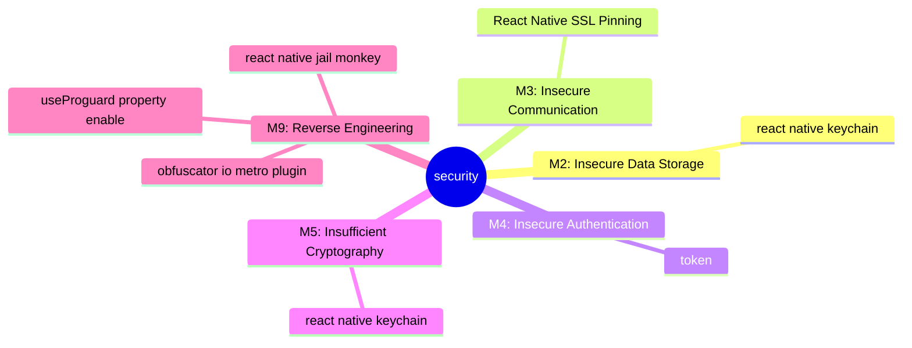
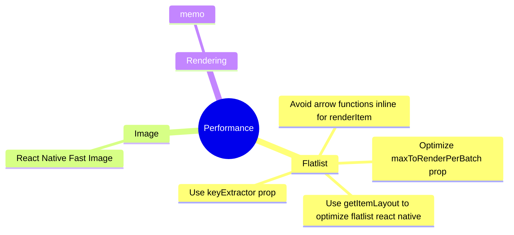

# SOLID and Clean Architecture in React Native with REDUX
This use case implement solid principle and clean architecture in react native combined with Redux

## Use Case Front End Development
Ricko Caesar Putra
ricko_c_putra@telkomsel.co.id

Download source code:
https://github.com/RickoCP/WeatherAppRNRicko/tree/dev

Download apk Android:
https://drive.google.com/file/d/1gCVPp5FjKY4gEnOLO004gPl7ZbbeQLe3/view?usp=sharing

## Use Stack
Typescript, React, React-Native, Redux

## Run Project
### Mobile(android)
#### Install
```shell
$ npm install
```
#### Start
```shell
$ npx react-native run-android
```

## Screen


## Authentication
Username: "" (blank)

Password: "" (blank)

## Clean Architecture


As with various architectures, the primary purpose of a clean architecture is to separate concerns. Divide the hierarchy according to each interest, design domain-centric rather than detailed implementation, and make sure that the internal area does not depend on external elements such as the framework or database UI.  
  
* Distinguish between detailed implementation areas and domain areas.
* Architecture does not depend on the framework.
* The outer zone can depend on the inner zone, but the inner zone cannot depend on the outer zone.
* Both high-level and low-level modules rely on abstraction..

## Data Flow


1. UI calls method from Presenter/ViewModel.
2. Presenter/ViewModel executes Use case.
3. Use case combines data from User and Post Repositories.
4. Each Repository returns data from a Data Source (Cached or Remote).
5. Information flows back to the UI where we display the list of posts

## Dependency Rule


Presentation Layer contains UI (Activities & Fragments) that are coordinated by Presenters/ViewModels which execute 1 or multiple Use cases. Presentation Layer depends on Domain Layer.
Domain Layer is the most INNER part of the onion (no dependencies with other layers) and it contains Entities, Use cases & Repository Interfaces. Use cases combine data from 1 or multiple Repository Interfaces.
Data Layer contains Repository Implementations and 1 or multiple Data Sources. Repositories are responsible to coordinate data from the different Data Sources. Data Layer depends on Domain Layer

## Communication Flow


in simple diagram, it is as above.

## Directory Structure
```
./src
├─ Core
│  ├─ di
│  ├─ initalData
│  └─ lib
├─ Data
│  ├─ infrastructures
│  │  └─ interfaces
│  └─ repositories
├─ Domain
│  ├─ aggregates
│  │  └─ interfaces
│  ├─ entities
│  │  └─ interfaces
│  ├─ useCases
│  │  ├─ interfaces
│  │  └─ repository-interfaces
│  └─ dto
└─ Presentation
   ├─ presenters
   │  ├─ interfaces
   │  └─ action-interfaces
   ├─ components
   │  ├─ assets
   │  └─ atomicDesign
   │     ├─ constants
   │     ├─ atoms
   │     ├─ molecules
   │     ├─ organism
   │     ├─ templates   
   │     └─ pages
   ├─ vm   
   └─ redux
      ├─ actions
      ├─ interfaces
      ├─ reducer
      └─ store
```

* The basic directory is organized based on layers of clean architecture.  
[ data / domains / presentation) ]


## SOLID Principle

### S — Single Responsibility
A class should only have a single responsibility, that is, only changes to one part of the software’s specification should be able to affect the specification of the class


### O — Open-Closed
Classes should be open for extension, but closed for modification
```js
export function ButtonComponent({
  className = '',
  themeInput = Day,
  variant = 'primary1',
  size = 'large',
  disabled = false,
  children,
  onClick,
  style = {},
  ...props
}: Readonly<IButtonProps>) {
  const onClickButton = () => {
    onClick();
  };

  return (
    <View style={style} className={className}>
      <Pressable
        style={pressed => [
          styles.buttonPrimer,
          pressed && theme(themeInput)[variant],
          buttonSize[size],
        ]}
        disabled={disabled}
        onPress={onClickButton}
        {...props}>
        {children}
      </Pressable>
    </View>
  );
}
```

### L-Liskov substitution principle
Objects in a program should be replaceable with instances of their subtypes without altering the correctness of that program.
“Components should abide by some kind of contract.”
At its core, this means there should be some kind of contract between components. So whenever a component uses another component, it shouldn’t break its functionality (or create any surprises).

```js
class DetailWeatherRepository implements IDetailWeatherRepository {
  constructor(
    private readonly http: IHttp,
    private readonly storage: IStorage,
  ) {}

  // ...
}
```

### I — Interface Segregation
Clients should not be forced to depend on methods that they do not use.


### D — Dependency Inversion
High-level modules should not depend on low-level modules. Both should depend on the abstraction.


```js
class DetailWeatherUseCase implements IDetailWeatherUseCase {
  constructor(private readonly detailWeatherRepo: IDetailWeatherRepository) {}

  async getDetailWeather(): Promise<IDetailWeatherEntity> {
    console.log('run getDetailWeather usecase');
    const selectedTerritory =
      await this.detailWeatherRepo.getSelectedTerritory();

    const selectedTerritoryData = new SelectedTerritory(selectedTerritory);

    const forecastWeather = await this.detailWeatherRepo.getForecastWeather(
      selectedTerritoryData.url,
    );

    const ferecastWeaterData = new ForecastWeather(forecastWeather);
  // ...
}
```

In the case of 'Repository', it is an adapter layer, so we should not know about 'Repository' in 'Use Case'. 
Therefore, in 'Use Case', it is implemented through the Repository Interface located in the domain layer, which is then operated through Dependency Injection.
The Action Interface of 'Presenter' is also the same.


## Design Pattern
### Template Method
behavioral design pattern that defines the skeleton of an algorithm in the superclass but lets subclasses override specific steps of the algorithm without changing its structure.


```js
const MainTemplate = ({header, children}: any) => {
  return (
    <SafeAreaView style={styles.mainPage}>
      {header && <View style={styles.mainHeader}>{header}</View>}
      <View style={styles.mainList}>{children}</View>
    </SafeAreaView>
  );
};
```

### Adapter
structural design pattern that allows objects with incompatible interfaces to collaborate.


```js
class DetailWeather implements IDetailWeatherEntity {
  private _selectedTerritory: ISelectedTerritoryEntity;
  private _forecastWeather: IForecastWeatherEntity;
  private _selectedCondition: ISelectedConditionEntity;

  constructor() {
    this._selectedTerritory = {
      id: initialSelected.id,
      name: initialSelected.name,
      region: initialSelected.region,
      country: initialSelected.country,
      url: initialSelected.url,
    };

    this._forecastWeather = {
      localtime: '',
      name: '',
      temp_c: 0,
      condition_text: '',
      condition_icon: '',
      sunrise: '',
      sunset: '',
      moonrise: '',
      moonset: '',
      forecastday_hour: [],
    };
    this._selectedCondition = {
      selected_time: '',
      selected_temp_c: 0,
      selected_wind_dir: '',
      selected_humidity: 0,
      selected_uv: 0,
    };
  }

  pushSelectedTerritory(selectedTerritoryItem: ISelectedTerritoryEntity) {
    this._selectedTerritory = selectedTerritoryItem;
    return this;
  }

  pushForecastWeather(forecastWeatherItem: IForecastWeatherEntity) {
    this._forecastWeather = forecastWeatherItem;
    return this;
  }

  pushSelectedConditionItem(selectedConditionItem: ISelectedConditionEntity) {
    this._selectedCondition = selectedConditionItem;
    return this;
  }
```

### Chain of Responsibility
behavioral design pattern that lets you pass requests along a chain of handlers. Upon receiving a request, each handler decides either to process the request or to pass it to the next handler in the chain.


```js
import infrastructures from './infrastructures';
import repositories from './repositories';
import actions from './actions';
import presenters from './presenters';
import useCases from './useCases';

const cInfrastructures = infrastructures();
const cRepositorires = repositories(cInfrastructures);
const cUseCases = useCases(cRepositorires);
const cActions = actions();
const cPresenters = presenters(cUseCases, cActions);

export default {
  session: cPresenters.session,
  detailWeather: cPresenters.detailWeather,
};
```

### Mediator
behavioral design pattern that lets you reduce chaotic dependencies between objects. The pattern restricts direct communications between the objects and forces them to collaborate only via a mediator object.


```js
class DetailWeatherPresenter implements IDetailWeatherPresenter {
  constructor(
    private readonly useCases: IDetailWeatherUseCase,
    private readonly actions: IDetailWeatherActions,
  ) {}

  async getDetailWeather(): Promise<IDetailWeatherAction> {
    console.log('run getDetailWeather presenter ');
    try {
      const DetailWeatherEntity: IDetailWeatherEntity =
        await this.useCases.getDetailWeather();
      this.setSelectedCondition(DetailWeatherEntity.selectedCondition);
      return this.actions.getDetailWeather(DetailWeatherEntity);
    } catch (err: any) {
      console.log('error getDetailWeather presenter:', err);
      Analytics.trackEvent('error getDetailWeather', {
        error: err,
      });
      return this.actions.getDetailWeatherError(err);
    }
  }
  // ...
}

```


## Design Systems
### Atomic Design


### Colour Theme
```js
export function mainTheme(theme: string): any {
  return StyleSheet.create({
    backgroundColor1: {
      color: theme === Day ? theme1.backgroundColor1 : theme2.backgroundColor1,
    },
    backgroundColor2: {
      color: theme === Day ? theme1.backgroundColor2 : theme2.backgroundColor2,
    },
    backgroundColor3: {
      color: theme === Day ? theme1.backgroundColor3 : theme2.backgroundColor3,
    },
    borderColor1: {
      color: theme === Day ? theme1.borderColor1 : theme2.borderColor1,
    },
    textColor: {
      color: theme === Day ? theme1.textColor : theme2.textColor,
    },
    textColor2: {
      color: theme === Day ? theme1.textColor2 : theme2.textColor2,
    },
    text: {
      color: theme === Day ? theme1.text : theme2.text,
    },
    background: {
      color: theme === Day ? theme1.background : theme2.background,
    },
    tint: {
      color: theme === Day ? theme1.tint : theme2.tint,
    },
    tabIconDefault: {
      color: theme === Day ? theme1.tabIconDefault : theme2.tabIconDefault,
    },
    tabIconSelected: {
      color: theme === Day ? theme1.tabIconSelected : theme2.tabIconSelected,
    },
    Theme1: {
      color: theme === Day ? theme1.Theme1 : theme2.Theme1,
    },
    Theme2: {
      color: theme === Day ? theme1.Theme2 : theme2.Theme2,
    },
    Theme3: {
      color: theme === Day ? theme1.Theme3 : theme2.Theme3,
    },
    Theme4: {
      color: theme === Day ? theme1.Theme4 : theme2.Theme4,
    },
  });
}

```
### Open Closed Principle Component and variant
```js
export function ButtonComponent({
  className = '',
  themeInput = Day,
  variant = 'primary1',
  size = 'large',
  disabled = false,
  children,
  onClick,
  style = {},
  ...props
}: Readonly<IButtonProps>) {
  const onClickButton = () => {
    onClick();
  };

  return (
    <View style={style} className={className}>
      <Pressable
        style={pressed => [
          styles.buttonPrimer,
          pressed && theme(themeInput)[variant],
          buttonSize[size],
        ]}
        disabled={disabled}
        onPress={onClickButton}
        {...props}>
        {children}
      </Pressable>
    </View>
  );
}
```

## Security




## Performance


